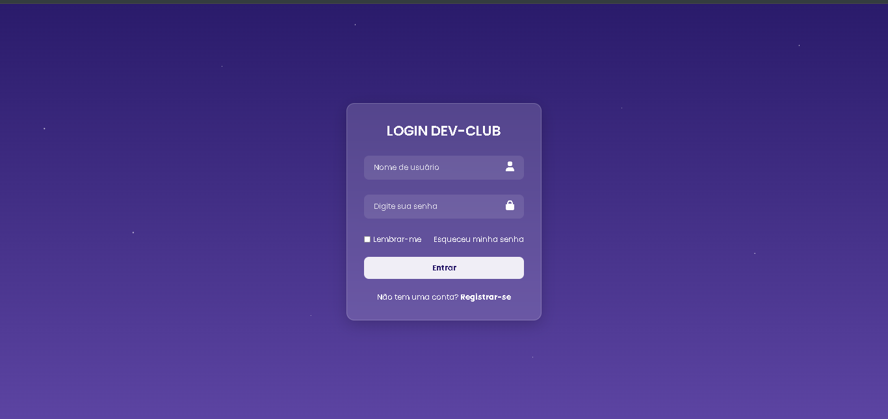

# 🌌 Projeto Login Dev-Club

Um projeto de interface de login moderna, desenvolvido com foco em **UI Design** e utilizando o conceito de **Glassmorphism** para criar um efeito de transparência elegante e minimalista.

## 📸 Preview



## 🚀 Sobre o Projeto

O objetivo deste projeto foi explorar propriedades avançadas do **CSS3** para criar uma experiência visual imersiva:

- **Glassmorphism**: Aplicação de `backdrop-filter: blur()` em containers translúcidos.
- **Estrelas Dinâmicas**: Fundo criado inteiramente via CSS com `radial-gradient`.
- **Design Responsivo**: Estrutura centralizada utilizando `Flexbox`.
- **Interatividade**: Efeitos de `hover` nos botões e links para melhorar a experiência do usuário.

## 🛠️ Tecnologias Utilizadas

- **HTML5**: Estrutura semântica do formulário.
- **CSS3**: Estilização, animações e efeitos visuais.
- **Font Awesome**: Ícones escaláveis.
- **Google Fonts**: Tipografia Poppins.

## 📦 Como rodar este projeto

1. Clone este repositório:

   ```bash
   git clone https://github.com/SEU-USUARIO/NOME-DO-REPOSITORIO.git
   ```

2. Abra o arquivo `index.html` no seu navegador.

3. Ou use um servidor local:
   ```bash
   python -m http.server 8000
   ```

## 📁 Estrutura

- `index.html` - Arquivo principal HTML
- `style.css` - Estilos CSS
- `img-tela-login.png` - Screenshot do projeto
